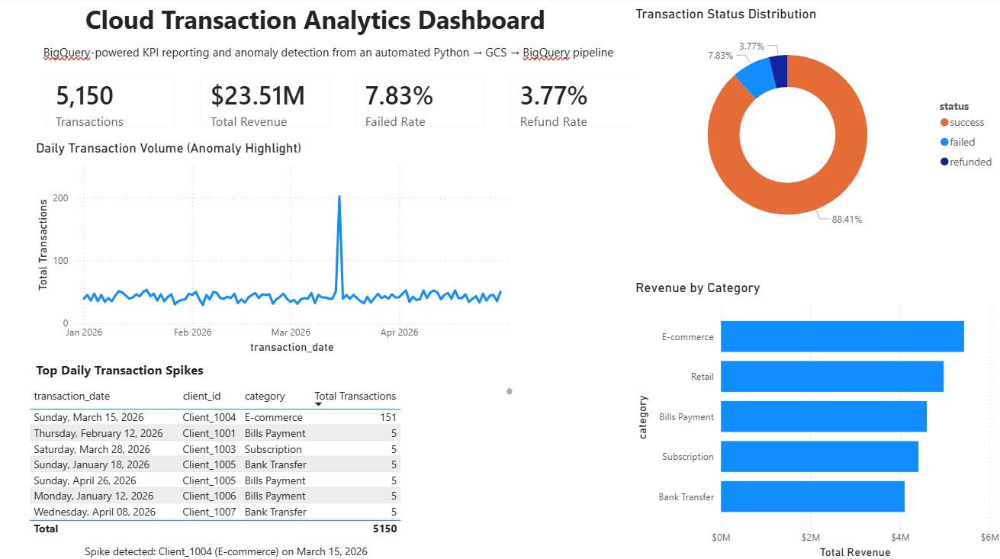
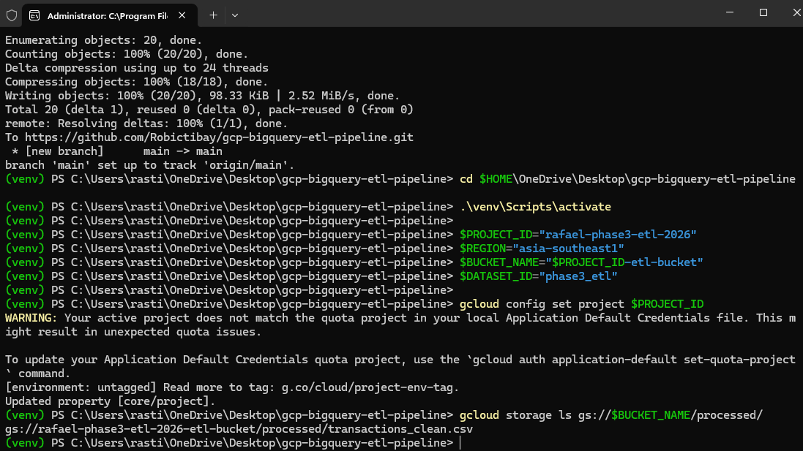
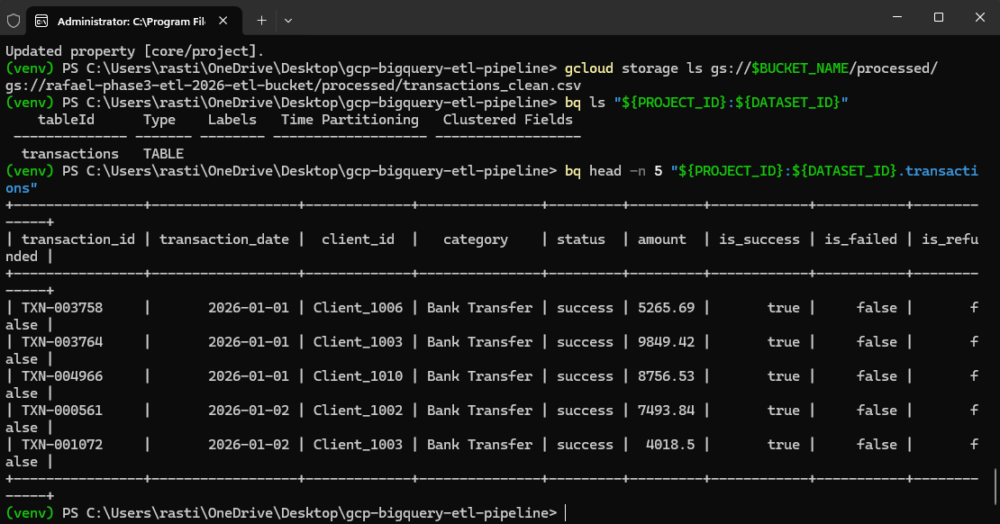
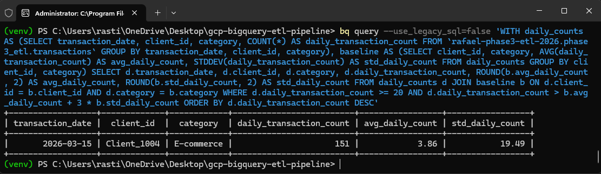
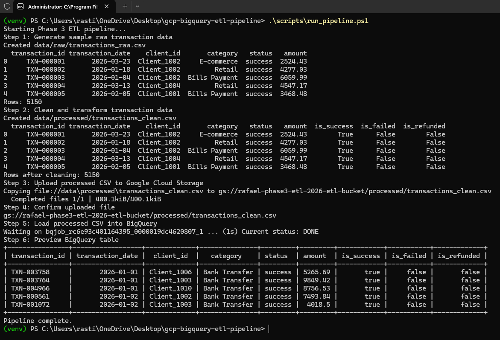

# GCP BigQuery ETL Pipeline

A cloud data engineering and BI project that generates synthetic transaction data with Python, stages it in Google Cloud Storage, loads it into BigQuery, runs SQL KPI/anomaly queries, and visualizes the warehouse data in Power BI.

---

## Overview

This project simulates a lightweight ETL pipeline for business transaction data. The data is synthetic and portfolio-safe — no real client or financial records involved.

This project demonstrates an end-to-end cloud analytics workflow from data generation to business-facing dashboarding using a modern data stack.

The pipeline goes:

```text
Python data generation → cleaning/transformation → GCS upload → BigQuery load → SQL analytics → Power BI dashboard
```

---

## Stack

Python · pandas · Google Cloud Storage · BigQuery · SQL · Power BI · gcloud CLI · bq CLI · PowerShell

---

## Key Features

- End-to-end automated ETL pipeline using Python and PowerShell
- Cloud data lake staging via Google Cloud Storage
- Data warehouse loading and querying in BigQuery
- SQL-based KPI reporting and anomaly detection
- Power BI dashboard connected directly to BigQuery

---

## Project Structure

```text
gcp-bigquery-etl-pipeline/
├── dashboard/
│   └── transaction_etl_dashboard.pbix
├── data/
│   ├── raw/
│   └── processed/
├── reports/
│   └── pipeline_summary.md
├── screenshots/
│   ├── 01_github_repo_home.png
│   ├── 02_gcs_bucket_file.png
│   ├── 03_bigquery_table_preview.png
│   ├── 04_anomaly_query_result.png
│   ├── 05_powershell_pipeline_complete.png
│   └── 06_powerbi_dashboard.png
├── scripts/
│   ├── generate_sample_data.py
│   ├── transform.py
│   └── run_pipeline.ps1
├── sql/
│   ├── kpi_queries.sql
│   └── anomaly_queries.sql
├── README.md
├── DEVLOG.txt
├── requirements.txt
└── .gitignore
```

---

## Dataset

5,150 synthetic transaction records with these fields: `transaction_id`, `transaction_date`, `client_id`, `category`, `status`, `amount`, `is_success`, `is_failed`, `is_refunded`.

One anomaly was intentionally injected — **Client_1004**, E-commerce category, **2026-03-15**, with a daily transaction count of 151 — to validate the detection query.

---

## SQL Analytics

- Total successful revenue
- Failed and refund transaction rates
- Revenue by category
- Top clients by transaction volume
- Daily anomaly detection

**Anomaly query result:**

| transaction_date | client_id   | category   | daily_transaction_count |
|------------------|-------------|------------|--------------------------|
| 2026-03-15       | Client_1004 | E-commerce | 151                      |

---

## Power BI Dashboard

A Power BI dashboard was built using the BigQuery `transactions` table as the BI layer. The dashboard includes KPI cards, revenue by category, transaction status distribution, daily transaction volume, and a table surfacing the detected transaction spike.



---

## Screenshots

| Step | Preview |
|------|---------|
| GCS Upload |  |
| BigQuery Table |  |
| Anomaly Query |  |
| Pipeline Run |  |
| Dashboard |  |

---

## How to Run

```powershell
# Activate environment
.\venv\Scripts\activate

# Set variables
$PROJECT_ID="rafael-phase3-etl-2026"
$REGION="asia-southeast1"
$BUCKET_NAME="$PROJECT_ID-etl-bucket"
$DATASET_ID="phase3_etl"

# Run pipeline
.\scripts\run_pipeline.ps1

# Preview BigQuery table
bq head -n 5 "${PROJECT_ID}:${DATASET_ID}.transactions"
```

---

## Status

- [x] Generated synthetic transaction data
- [x] Cleaned and transformed CSV
- [x] Uploaded to Google Cloud Storage
- [x] Loaded into BigQuery
- [x] Ran KPI queries
- [x] Ran anomaly detection
- [x] Added proof screenshots
- [x] Built Power BI dashboard connected to BigQuery
